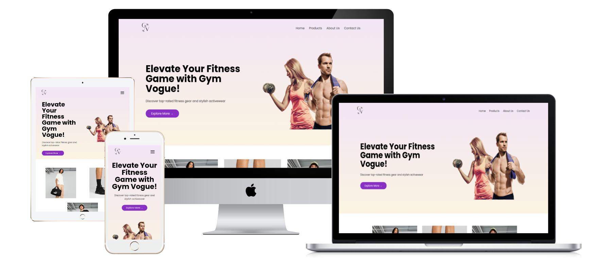

<h1 align="center">Gym Vogue</h1>

GymVogue is a sleek and responsive fitness website developed with Flask, HTML, CSS, and JavaScript. Designed to provide a seamless e-commerce experience, GymVogue allows users to browse a variety of fitness products, view detailed descriptions, and access the best deals through a simple redirect to external platforms. Whether you're a fitness enthusiast looking for gear or someone just starting their fitness journey, GymVogue offers a user-friendly platform to explore and shop the latest fitness products online.</em>

  

  
  
  
  

## 🏋️‍♀️Project Vision

<strong>GymVogue</strong> is an innovative and user-friendly fitness e-commerce website designed to help users discover the best fitness products and gear. By combining a sleek interface with seamless e-commerce features, GymVogue allows users to browse a wide range of fitness products, view detailed descriptions, and access the best deals from top fitness platforms. With a growing catalog of products and an easy-to-use shopping experience, GymVogue is redefining how fitness enthusiasts shop online.
 
<em>Story</em>: GymVogue is a one-stop platform where users can find everything they need for their fitness journey. Whether you're a beginner looking for essential gear or an experienced athlete exploring new products, GymVogue ensures a smooth, reliable, and engaging shopping experience. Every product is carefully curated to meet the needs of fitness lovers at every stage of their journey.

---

## ✨ Live Website

 <strong>GymVogue</strong> is now live and available for users to explore! Our responsive fitness e-commerce platform is fully functional, allowing you to browse products, view detailed descriptions, and find the best deals all in one place. Visit the website and start shopping today! 
 
  

# Key Highlights:

- **Responsive Design**: Seamlessly works on both mobile and desktop devices.
- **Fitness Product Catalog**: Browse through a wide range of fitness gear and products with detailed descriptions and prices.
- **Best Deals**: Get redirected to the best deals available on the web for your favorite products.

---

## 🖥️ Technology Stack

- **Frontend**: HTML, CSS, and JavaScript for a responsive, modern user interface.
- **Backend**: Backend: Flask for the backend, handling dynamic content and user interactions efficiently.
- **Deployment**: Hosted on [PythonAnywhere](https://gymvogueonline.pythonanywhere.com), providing a reliable and scalable platform for users to access GymVogue.

---

## 🌐 Accessing the Website

You can visit *Gym Vogue* at [GymVogue](https://gymvogueonline.pythonanywhere.com).

  

  

---

---

## 🚀 Future Plans

*GymVogue* is just getting started! Here’s what’s coming up:

- **User Accounts and Profiles**: Create an account, track your orders, and manage your preferences for a personalized experience.
- **Wishlist Feature**: Save your favorite products and receive alerts when they go on sale or restock.
- **Product Reviews and Ratings**: Share your experiences with products and read reviews from other users.
- **Advanced Search Filters**: Improve product discovery with more filtering options (price, brand, rating, etc.).
- **Fitness Tips and Guides**: Add a blog or resource section with fitness tips, workouts, and expert advice.

---

## 🧑‍🤝‍🧑 Contributions & Community

Interested in helping *GymVogue* grow? Contributions are welcome! Here’s how:

1. **Fork** the repo.
2. **Create a new branch** (`git checkout -b feature-name`).
3. **Commit** your changes.
4. Open a **Pull Request** with details about your changes.

The codebase is beginner-friendly, with simple HTML, CSS, Flask, and JavaScript components. We're excited to have contributors who can help improve the website, whether through new features, bug fixes, or design enhancements.
---

## 👨‍💻 Author

GymVogue was created by [Saurabh Tiwari](https://github.com/Rexaintreal).

You can reach out to Saurabh at:

- 📧 [Email Saurabh](mailto:saurabhtiwari7986@gmail.com)
- 📱 [DM Saurabh on Instagram](https://instagram.com/saurabhcodesawfully)

---
## 💡 You may also like...

- [Libro Voice](https://github.com/Rexaintreal/Libro-Voice) - A PDF to Audio Converter
- [Snippet Vision](https://github.com/Rexaintreal/Snippet-Vision) - A YouTube Video Summarizer
- [Weather App](https://github.com/Rexaintreal/WeatherApp) - A Python Weather Forecast App
- [Python Screenrecorder](https://github.com/Rexaintreal/PythonScreenrecorder) - A Python Screen Recorder
- [Typing Speed Tester](https://github.com/Rexaintreal/TypingSpeedTester) - A Python Typing Speed Tester
- [Movie Recommender](https://github.com/Rexaintreal/Movie-Recommender) - A Python Movie Recommender
- [Password Generator](https://github.com/Rexaintreal/Password-Generator) - A Python Password Generator
- [Object Tales](https://github.com/Rexaintreal/Object-Tales) - A Python Image to Story Generator
- [Finance Manager](https://github.com/Rexaintreal/Finance-Manager) - A Flask WebApp to Monitor Savings
- [Codegram](https://github.com/Rexaintreal/Codegram) - A Social Media Web App for Coders
- [Simple Flask Notes](https://github.com/Rexaintreal/Simple-Flask-Notes) - A Flask Notes App
- [Key5](https://github.com/Rexaintreal/key5) - Python Keylogger
- [Codegram2024](https://github.com/Rexaintreal/Codegram2024) - A Modern Version of Codegram (Update)
- [Cupid](https://github.com/Rexaintreal/cupid) - A Dating Web App for Teenagers
 
